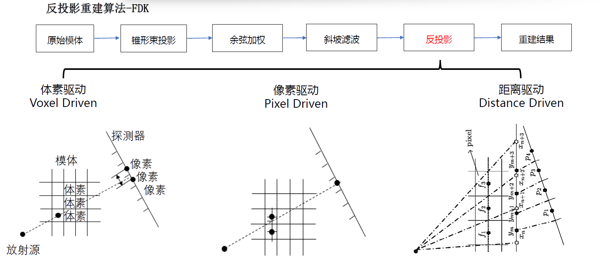
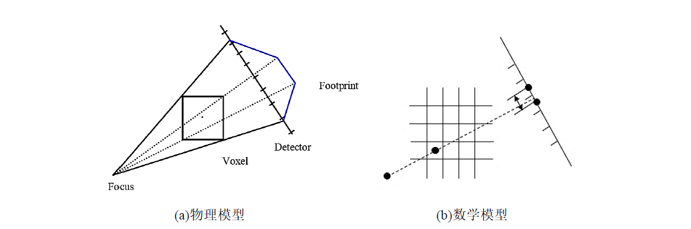
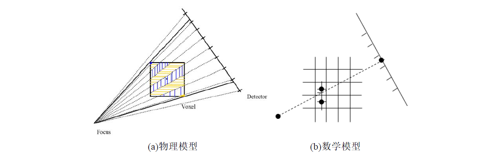
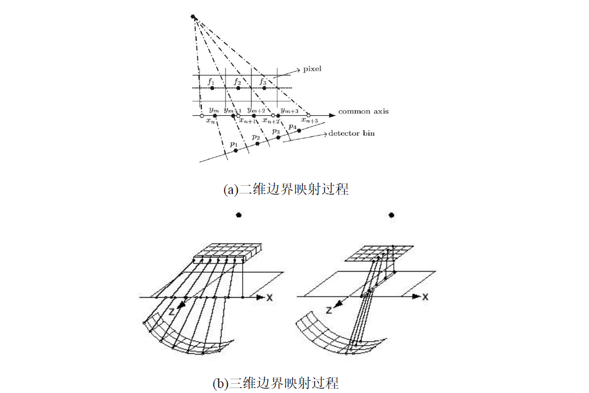

# DistanceDrivenFDK
A Fast Reconstruction Algorithm Research For CBCT

This repo is used as a record of a research on 3d reconstruction algorithm (Distance-Driven Back Projection of FDK Algorithm) in 2018

In the field of cone-beam CT reconstruction, FDK type reconstruction algorithm is widely used. 
For this kind of algorithm, the image back-projection step is the most time-consuming one. 
In this research, a variety of back-projection methods are compared, and a version that uses spatial geometry properties, engineering skills, and derived algorithms is introduced for the Distance Driven back-projection algorithm. 
Both the algorithm and the optimized version are implemented using the CPU and the CUDA parallel computing platform.

Techniques:
   - Algorithms/Models: Three-dimensional reconstruction, back-projection reconstruction, FDK, Distance-driven, Voxel-driven, Pixel-driven
   - Frameworks/Libraries: RTK, ITK
   - Languages: C++, CUDA C
   
Highlight:
   - The Distance driven method with no open source code is implemented using C++ based on which improvement is made in the selection of voxels' boundary points using CPU. 
   - An optimized version is implemented using texture memory, hardware interpolation and integral images on the CUDA parallel computing platform.
   
Important References:
   - [Distance-driven projection and backprojection in three dimensions](https://iopscience.iop.org/article/10.1088/0031-9155/49/11/024/pdf)
   - [GPU-based Branchless Distance-Driven Projection and Backprojection](https://www.ncbi.nlm.nih.gov/pmc/articles/PMC5761753/)

 Part of the codes for cpu and gpu versions of distance-driven fdk algorithm are shown in this repo.
 You are welcome to contact [me](https://www.linkedin.com/in/yuhua-angela-ma-676a73184/) and ask any questions about this project.

# Further explanation

## Abstract
 Cone beam computed tomography (or CBCT) projects cone-shape X rays onto the objects and reconstructs the object using projected images. This imaging technique plays an important role in position verification of tumor radiotherapy. Studying the rapid imaging method of cone beam CT is of great significance for promoting its applications. The common algorithms for 3D reconstruction of cone beam CT include iterative reconstruction algorithm and back projection reconstruction algorithm. Iterative reconstruction algorithm is high in accuracy, but the reconstruction is slow while the reconstruction accuracy of back projection reconstruction algorithm can meet the needs of use while having a moderate reconstruction speed. How to improve the back projection speed is the focus of fast algorithm research. 
  This research analyzes the mathematical principle of CT reconstruction based on the introduction of parallel beam, fan beam and cone beam reconstruction. The principle of cone beam CT reconstruction and the FDK algorithm are emphatically analyzed. Then three back projection methods of FDK algorithm are discussed which are Voxel driven method, Pixel driven method and Distance driven method. The Distance driven method with no open source code is implemented using C++ based on which improvement is made in the selection of voxels' boundary points using CPU. Then, an optimized version is implemented using texture memory, hardware interpolation and integral images on the CUDA parallel computing platform. The result shows that the reconstruction speed of optimized Distance driven algorithm is improved while the image quality remains unchanged.

## Key words
Three-dimensional reconstruction, CBCT, back-projection reconstruction, FDK, Distance-driven

### Background Knowledge

What we meanly need to know before implementing codes is the pipeline of FDK algorithms and different Projection/BackProjection(P/BP) models
FDK algorithms
   - weighting
   - filtering
   - back projection
P/BP models
   - Voxel-driven P/BP models
   - Pixel-driven P/BP models
   - Distance-driven P/BP models

 Voxel-driven

BP Path: connection between the source and the center of each voxel of the phantom
BP value: the interpolation result at the intersection of the ray and the detector
   - Works well for forward projection. 
   - Tends to introduce Moiré pattern artefacts in backprojection   
   - Difficult to be parallelized because they access memory in a non-sequential pattern

 Pixel-driven

Pixel-driven P/BP methods work by tracing rays through the image, essentially discretizing the line integral directly, and thus approximating each line integral as a weighted sum of all image pixels that lie close to the ideal line.

BP Path: connection between the source and the center of each pixel unit of the detector
BP value: the weighted sum of attenuation coefficients of all voxels that lie close to the ray

   -  Suitable for hardware implementation with specialized circuit . 
   - Tends to introduce Moiré pattern artefacts in backprojection   
   - Not straightforward to parallelize. 

 Distance-driven(ray-driven)

BP Path: This method projects the boundary of each voxel and the boundary of each pixel unit of the detector onto a common plane(if 3d reconstruction)/common axis(if 2d reconstruction).
BP value: The distance driven kernel uses the length of overlap between each source and each destination to perform a weighted sum of the source values.
   - Distance-driven is a novel projection and backprojection approach that has a low arithmetic complexity, a highly sequential (and thus predictable) memory access pattern, and that avoids the artefact characteristics of voxel-driven backprojection and pixel-driven projection.

   - RTK doesn’t have open source code for distance-driven methods

### Programming references
[ITK](https://itk.org/ItkSoftwareGuide.pdf)
[RTK](http://www.openrtk.org/Doxygen/index.html)
[CUDA](https://docs.nvidia.com/cuda/)
  My designation for CUDA GPUs is shown below:

 My cute dd fdk reconstruction algorithm was tested on a medical software product and won an outstanding graduation thesis award in 2018.

 copyright
 xiaoma1002

